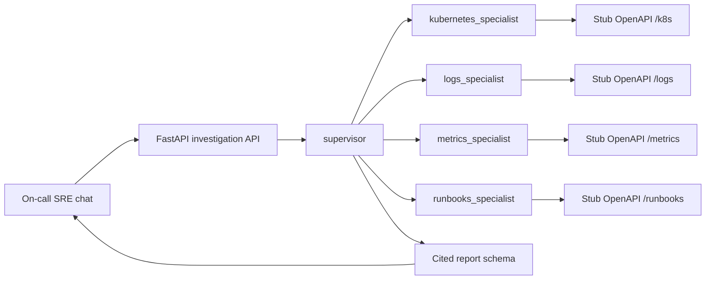
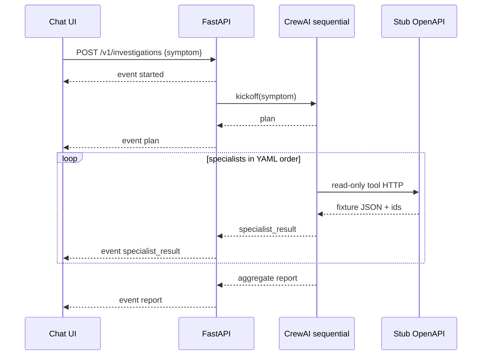

# System Architecture Document: Multi-Agent SRE Incident-Response Assistant

## Context & Instructions

This SAD is the Build-phase blueprint for an investigation-first multi-agent SRE assistant. It is derived from the PRD and MRD; it does not invent product requirements. Agent topology, API contracts, and deployment views align with `AAMAD_TARGET_RUNTIME=crewai` (resolved default) and `.cursor/rules/adapter-crewai.mdc`. Amazon Bedrock AgentCore is documented as an **optional AWS host/MCP path**, not as an `AAMAD_TARGET_RUNTIME` value.

Frontend is a modern web chat UI (Next.js App Router + Tailwind), matching the AAMAD `@frontend.eng` persona default because the PRD specifies chat MVP without naming a vendor UI library. Python is the backend/runtime language per `aamad.config.yml`.

This document prefers lean MVP views. Nonessential NFRs, live telemetry connectors, mutating remediation, Slack/PagerDuty intake, and enterprise identity are deferred to Future Work.

## Input Requirements

**PRD Document**: `project-context/1.define/prd.md` (authoritative for product scope; created 2026-08-13, action `create-prd`)  
**MRD**: `project-context/1.define/mrd.md` (authoritative market and AWS reference-pattern input; created 2026-08-13, action `create-mrd`)  
**User Stories**: **Not present.** `project-context/1.define/user-stories/` does not exist (`*create-stories` was not run). Functional requirements use PRD FR-/AC- IDs.  
**System Description**: **Not present.** `project-context/1.define/system-description.md` was not elicited. Gaps remain under Assumptions and Open Questions.  
**MVP Scope**: Investigation-only crew (supervisor + four specialists), cited report, read-only stub OpenAPI backends, AAMAD chat UI, no cluster mutation (PRD §4 P0; Go/No-Go).  
**Selected Runtime**: `crewai` (`AAMAD_TARGET_RUNTIME` unset; `aamad.config.yml` `runtime.target: crewai`; adapter registry default).

---

## System Architecture Specification — Generate All Sections

### 1. MVP Architecture Philosophy & Principles

**Stakeholders and concerns** (ISO/IEC/IEEE 42010):

| Stakeholder | Concerns | Architectural response |
| --- | --- | --- |
| On-call SRE / platform engineer (primary) | Time-to-context; verifiable RCA; no surprise mutations | Numbered plan before aggregate report; source IDs on state-asserting insights; read-only tools |
| Incident commander (human) | Severity, comms, and change execution stay human | Assistant never assumes commander role; remediation is unexecuted instruction |
| Engineering manager / error-budget owner (secondary) | Blast radius and escalation | Single SRE-facing report in MVP; Alice/Carol split is P1 (FR-104) |
| Operator / builder | Reproducible MVP; no live cluster credentials | CrewAI sequential YAML crew; stub backends; secrets as env names only |
| Security reviewer (`@security.eng`) | Secret leakage, unsafe automation | Redaction; `forbid_committed_secrets`; security.md required before Deliver |

**Viewpoints and correspondence**: Logical (agents/tools) ↔ Process (CrewAI task chain) ↔ Interface (chat events) ↔ Information (request-scoped report schema) ↔ Deployment (compose services) ↔ Security (allowlists). Correspondence rule: YAML agent keys, tool names, SSE event `specialist` fields, and log `agent` fields use the same identifiers (`supervisor`, `kubernetes_specialist`, `logs_specialist`, `metrics_specialist`, `runbooks_specialist`).

**MVP Design Principles**:

- Customer / operator feedback first: interrupt-driven chat; first message is an alert paste or natural-language symptom (FR-001).
- Minimal viable agent set and simplest orchestration that delivers core value: supervisor + four specialists; CrewAI **sequential** process; `allow_delegation=false`.
- Observable by default: structured agent/tool/latency/error logs with secret redaction under `project-context/2.build/logs`; `GET /health`.
- Automated deploy scaffolding from day 1 when Deliver is in scope: lint/test/build CI only; no live deploy without operator authorization.

**Core vs Future Features**:

- **MVP**: FR-001–FR-008 (intake, plan transparency, five-agent crew, cited report, read-only stubs, HITL/no mutation, grounding, operator logs). Chat UI + FastAPI + CrewAI + stub OpenAPI surfaces.
- **Future (P1)**: FR-101 live read connectors; FR-102 AgentCore Gateway/Runtime; FR-103 plan approve/edit; FR-104 role-conditioned reports; FR-105 similar-incident lookup; FR-106 memory namespaces.
- **Future (P2)**: FR-201 Slack/Teams; FR-202 PagerDuty inbound; FR-203 HITL-gated mutation; FR-204 extra specialists; FR-205 autonomous start; FR-206 postmortem loop; FR-207 SSO/JWT/segmentation; FR-208 monetization.
- **Explicit exclusions (MVP)**: live kube-apiserver; mutating tools (`apply`/`restart`/`scale`/`rollback`/`delete`); Security/Database/Network agents; durable customer datastore; SSO; always-on background hunter; competing on Datadog/Azure first-party telemetry.

**Technical Architecture Decisions**:

| ID | Decision | Rationale (trace) |
| --- | --- | --- |
| AD-01 | Runtime `crewai`; AgentCore is optional host/MCP only | PRD Selected Runtime; MRD Dim. 2; adapter registry. Do not invent `AAMAD_TARGET_RUNTIME=bedrock-agentcore`. |
| AD-02 | Five runtime agents: supervisor + Kubernetes, logs, metrics, runbooks specialists | PRD §3 Core Agent Definitions; AWS reference. Template “3–4 specialists” is met (four specialists; supervisor is coordinator). |
| AD-03 | Sequential CrewAI process; `Task.context` chain; `allow_delegation=false`; not hierarchical | Adapter-crewai reproducibility; PRD collaboration pattern. Parallel specialists deferred (PRD OQ 11 / MRD medium risk). |
| AD-04 | `memory=False`; request-scoped transcript only | PRD assumption 10; adapter-crewai default. |
| AD-05 | Next.js App Router + Tailwind + TypeScript chat UI; Python FastAPI + CrewAI backend | PRD: web chat MVP, no vendor named. AAMAD `@frontend.eng` implements Next.js/Tailwind. Config `language.primary: python` applies to runtime. TypeScript is SAD-justified secondary for the UI only. |
| AD-06 | SSE (or equivalent event stream) for lifecycle events; not token-level LLM streaming | FR-002 requires plan **before** final report; CrewAI is task-granular. Tests may use a non-streaming JSON snapshot of the same schema. |
| AD-07 | Four **logical** stub OpenAPI surfaces; one stub process allowed in MVP compose | PRD FR-005; smallest deploy (MRD Dim. 4). Path prefixes remain contract-stable for later split/live drop-in. |
| AD-08 | No durable store | PRD Integration Requirements. |
| AD-09 | Unauthenticated local chat; no demo shared-secret required | PRD §5: unauthenticated unless SAD adds a secret. Elicitation absent — do not add auth without a stakeholder. Optional `DEMO_API_TOKEN` remains Open Question. |
| AD-10 | `max_iter <= 12`; `max_retry_limit >= 2`; `max_execution_time = 600` seconds; low temperature | PRD §3/§5; adapter-crewai. 600s is the PRD suggested cap (planning assumption, not a published SLO). |
| AD-11 | Investigation vs remediation are separate classes; MVP tool surface is read-only | FR-006; MRD Dim. 2 insight 2. “Auto-execute: Yes” means run the **read** plan only. |

---

### 2. Multi-Agent System Specification

**Agent Architecture Requirements**

**Primary presentation (logical view)**:



In MVP sequential mode the supervisor does not fan-out concurrently; the diagram shows domain ownership, not parallel runtime.

**Element catalog**:

| Agent key | Role | Goal | Tools (least privilege) | Memory | Delegation |
| --- | --- | --- | --- | --- | --- |
| `supervisor` | SRE investigation coordinator | Turn alert/symptom into a numbered plan, invoke specialists within read-only bounds, return a cited report a human can verify | None for cluster I/O. Coordinates via CrewAI task graph only. No mutating tools. | `False` | `false` |
| `kubernetes_specialist` | Kubernetes infrastructure investigator | Report pod/node/deployment/event status grounded in tool results; never invent cluster objects | Read-only stub: `get_pod_status`, `get_node_status`, `get_deployment_status`, `get_cluster_events` | `False` | `false` |
| `logs_specialist` | Application log investigator | Search and pattern-count logs for the investigation window; cite result IDs | Read-only stub: `search_logs`, `count_log_patterns` | `False` | `false` |
| `metrics_specialist` | Performance metrics investigator | Pull latency, error, saturation, availability trends; cite series IDs; numeric claims match payloads | Read-only stub: `get_performance_metrics`, `get_error_metrics`, `get_availability_metrics` | `False` | `false` |
| `runbooks_specialist` | Operational runbook investigator | Retrieve matching playbooks, escalation, troubleshooting with document/section citations | Read-only stub: `search_runbooks`, `get_playbook`, `get_escalation_procedure` | `False` | `false` |

Tool names are a **subset** of the AWS AgentCore SRE 21-tool catalog (MRD Dim. 2). Names stay stable so live MCP/OpenAPI connectors can replace stubs (FR-101) without renaming agents. Semantic `x_amz_bedrock_agentcore_search` is **not** in MVP.

**Collaboration pattern**: Supervisor owns planning and synthesis. Specialists own only their tool domain. No specialist delegates to another specialist. Supervisor **halts synthesis of uncited state claims** (PRD supervisor runtime notes): if a specialist asserts cluster/log/metric/runbook state without a source id, treat as Diagnostic and omit or flag the claim.

**Session / memory**: No CrewAI memory. No AgentCore namespaces (`/sre/users/{user_id}/preferences`, infrastructure knowledge, investigation history). If memory is later enabled, set `CREWAI_STORAGE_DIR` to a project-scoped path and record retention in Audit (adapter-crewai).

**Task / Turn Orchestration**

**Primary presentation (process view)** — sequential `Task.context` chain:

1. `task_plan` (`supervisor`): ingest `symptom` text → numbered investigation plan (steps, agents involved, complexity or equivalent, `auto_execute_reads: true`).
2. `task_kubernetes` (`kubernetes_specialist`): context = plan (+ symptom) → cited k8s findings or explicit empty-tool result.
3. `task_logs` (`logs_specialist`): context = plan + k8s findings → cited log findings or empty-tool result.
4. `task_metrics` (`metrics_specialist`): context = plan + prior specialist outputs → cited metric findings or empty-tool result.
5. `task_runbooks` (`runbooks_specialist`): context = plan + prior outputs → cited playbook/escalation/troubleshooting or empty-tool result.
6. `task_aggregate` (`supervisor`): context = plan + all specialist outputs → report with headings Key Insights, Next Steps, Critical Alerts, Troubleshooting Steps; remediation as unexecuted instructions.

YAML lives in `config/agents.yaml` and `config/tasks.yaml`. Each task has `id`, `expected_output` (required headings / JSON keys), and explicit context dependencies. `ProcessType.sequential`. Do not switch to hierarchical or function-calling mode mid-run.

**Expected outputs and data formats** (logical; Build may serialize as JSON):

Plan object:

- `steps[]`: `{ "ordinal": number, "description": string, "agent": agent_key }`
- `agents_involved[]`: agent_key
- `complexity`: string (e.g. low/medium/high) or equivalent
- `auto_execute_reads`: boolean (MVP always true for reads; not a mutation flag)

Specialist finding:

- `specialist`: agent_key
- `insights[]`: `{ "text": string, "source": { "tool": string, "record_id": string }, "grounded": true }`
- `empty_tools[]`: tool names that returned no data (AC-011)
- `error`: optional Diagnostic reason if the specialist failed

Report object (FR-004 / AC-005 / AC-006):

- `key_insights[]`: each state-asserting item **must** include `source` (tool + record/id) and `specialist`
- `next_steps[]`: human instructions; `kubectl`/playbook steps marked `executed: false`
- `critical_alerts[]`: empty allowed only if labeled no findings
- `troubleshooting_steps[]`: empty allowed only if labeled no findings
- `stub_data: true` on MVP reports so operators do not treat demo data as production (PRD UX)

**Error handling, retries, cancellation / timeout**:

- Per-task `max_retry_limit >= 2` for transient stub/LLM failures.
- Specialist failure: supervisor still emits a **partial** cited report plus `diagnostic` (failed specialist, reason). Do not invent substitute findings (AC-004, AC-011).
- LLM/provider unreachable: fail fast with Diagnostic `LLM_UNAVAILABLE`; do not hang past HTTP client timeout.
- Budget/context overrun or `max_iter` / `max_execution_time` breach: halt; Diagnostic `BUDGET_EXCEEDED` or `CREW_TIMEOUT`; no retry loop (adapter-crewai Failure Policy; MRD Dim. 4 insight 5).
- Cancellation: if the client closes the SSE/request, abort the crew when the runtime allows; otherwise the process finishes and discards the unused result. Document actual abort behavior in `backend.md` Audit.
- Guardrails: aggregate `expected_output` must contain the four report headings; reject mutating HTTP methods in tool implementations; redact secrets from specialist log snippets before they enter the report (PRD logs specialist notes).

**Performance budgets**:

| Control | MVP value |
| --- | --- |
| `max_iter` | `<= 12` |
| `max_execution_time` | `600` seconds (crew/investigation) |
| `max_retry_limit` | `>= 2` |
| `max_rpm` | crew-level cap; starting value `10` (assumption; tune in Build if provider limits require) |
| Temperature | low (starting `0.1`; exact value is Build Audit) |
| Concurrency | one investigation per API process |
| Plan visibility target | plan event within 30 seconds of kickoff when LLM is reachable (PRD planning assumption, not SLO) |

**Runtime-Conditional Configuration**

- **crewai** (selected):
  - Composition: one crew; five agents as catalogued; sequential process.
  - Config: `config/agents.yaml`, `config/tasks.yaml`, entry `crew.py` (or equivalent).
  - Fields per agent: `role`, `goal`, `backstory`, `tools`, `memory=False`, `allow_delegation=false`.
  - Task context chaining as the six-task list above. `kickoff_for_each` is **not** used (single investigation input).
  - Tools: in-process CrewAI tools that HTTP GET/POST **read** operations to stub OpenAPI; JSON-serializable args; base URLs from env vars.
  - Prompt Trace / lifecycle: step callbacks or equivalent; persist redacted traces under `project-context/2.build/logs`.
- **claude-agent-sdk**: not selected. If the operator later switches runtime, map supervisor → coordinator and specialists → `AgentDefinition` with `allowed_tools`; out of this SAD’s Build scope.
- **cursor-sdk**: not selected.

---

### 3. Frontend Architecture Specification

**Technology Stack** (PRD silent on vendor; SAD default + AAMAD FE persona):

- Framework: Next.js (App Router)
- Language: TypeScript
- UI: React components; Tailwind CSS for layout/spacing
- Theme: `aamad.config.yml` `theme: system`, `visual_style: minimal`, `prefer_modals: false`
- Type safety: TypeScript strict; shared request/event types duplicated or copied as FE-local until integration (FE epic does not wire the backend)
- State: React local/component state for the active investigation; no Redux/global store required

**Application Structure**:

- Routes: `/` primary chat; no auth routes in MVP.
- API client boundary: a typed client module (e.g. `lib/api.ts`) **stubbed or unused** during `@frontend.eng`; `@integration.eng` points it at the backend. FE epic must not call live CrewAI.
- Components (logical): `ChatComposer` (alert/symptom first message); `PlanPanel` (numbered steps, agents, auto-execute-reads); `SpecialistUpdates` (inline, not modals); `CitedReport` (four sections + source IDs); `StubBanner` (demo data); `ErrorBanner`; Future Work placeholders.
- Responsive: usable on desktop browser; mobile-from-phone is Future Work (PRD §6).
- Accessibility (assumption, not elicited): keyboard-usable composer and send; citations as text not color-only; no WCAG claim (Open Question).

**Interface Requirements**:

- Primary surface: interrupt-driven chat. Empty submit → validation, no kickoff (AC-002). Non-empty submit → UI shows work has begun (AC-001).
- Loading: in-progress per specialist; plan rendered when `plan` event arrives, **before** the aggregated report (AC-003).
- Errors: validation, LLM unavailable, timeout, partial specialist failure — user-visible, operational language, no marketing filler.
- Placeholders (visible, non-functional) for Future Work: Slack/Teams intake, PagerDuty inbound, executive (Carol) report style, auto-remediation. Label them Future Work.
- Language: operational and cited. AWS CLI (`sre-agent --prompt ...`) is a UX mock, **not** a required MVP CLI.

---

### 4. Backend Architecture Specification

**API Architecture**

Base URL (local): `http://127.0.0.1:8000`

| Method | Path | Purpose |
| --- | --- | --- |
| GET | `/health` | Liveness; no LLM call |
| POST | `/v1/investigations` | Start investigation; body `{ "symptom": string }` (`minLength` 1) |
| GET | `/v1/investigations/{id}` | Optional snapshot for tests/clients that cannot SSE |

**Chat (investigation) request schema**:

```json
{ "symptom": "string" }
```

Reject empty/whitespace with `400` + error envelope (AC-002 may be enforced in UI and/or API).

**Streaming / event envelope** (SSE `text/event-stream` on POST, or NDJSON equivalent). Event types:

| `event` | Payload (conceptual) | UI effect |
| --- | --- | --- |
| `started` | `{ "investigation_id": string, "stub_data": true }` | Work has begun |
| `plan` | plan object (AD-06 / FR-002) | Show numbered plan |
| `specialist_result` | specialist finding object | Per-agent update |
| `report` | report object | Final cited report |
| `error` | error envelope | User-visible failure |
| `diagnostic` | partial failure detail | Partial report path |

Non-streaming fallback (QA/unit): `200` JSON `{ "investigation_id", "plan", "specialist_results", "report", "diagnostic" }` with the same shapes. Frontend may use SSE as primary; tests may use JSON.

**Error envelope**:

```json
{ "error": { "code": "VALIDATION_ERROR|LLM_UNAVAILABLE|CREW_TIMEOUT|BUDGET_EXCEEDED|SPECIALIST_FAILURE|INTERNAL", "message": "string", "diagnostic": "string" } }
```

**Validation**: `symptom` required non-empty string; reasonable max length (Build: e.g. 8 KiB) to bound tokens.  
**Rate limiting**: in-process **single investigation** mutex per API process (PRD concurrency). Excess requests: `429` with `code` indicating busy. No distributed rate limiter in MVP.

**Alignment with crewai adapter**: HTTP layer calls `crew.kickoff(inputs={"symptom": ...})` (or equivalent) after validating tools bind. YAML-referenced tools must exist or kickoff must not start (adapter-crewai Tools / Failure Policy).

**Data Architecture** (MVP default: none):

- No database. Investigation id may be a UUID in memory for the request lifetime (and a short in-process map if GET snapshot is implemented; TTL not beyond process life).
- Persistence of production telemetry is forbidden in MVP (PRD §5).
- Deferred: AgentCore Memory namespaces; investigation history (FR-105/FR-106).

**Runtime Integration Layer**:

- FastAPI (Python) loads CrewAI crew from YAML, injects stub base URLs, kicks off sequential tasks.
- Agent configuration management: YAML only; no runtime agent editor.
- Logging / Prompt Trace: redacted system/user prompts and task start/stop/retry/guardrail outcomes to `project-context/2.build/logs` (AC-012). Do not log `ANTHROPIC_API_KEY` or other secret values. Prompt Trace for production-facing crew runs is a Build concern; this SAD does not embed traces.

**Authentication & Secrets** (env-var **names** only):

| Name | Required for local MVP | Purpose |
| --- | --- | --- |
| `ANTHROPIC_API_KEY` | Yes for live LLM | Claude-class model via Anthropic API (PRD). Exact model id is Build Audit. |
| `STUB_K8S_BASE_URL` | Yes | Kubernetes stub OpenAPI |
| `STUB_LOGS_BASE_URL` | Yes | Logs stub |
| `STUB_METRICS_BASE_URL` | Yes | Metrics stub |
| `STUB_RUNBOOKS_BASE_URL` | Yes | Runbooks stub |
| `GATEWAY_ACCESS_TOKEN` | No (P1/AgentCore) | AgentCore Gateway if/when used |
| `DEMO_API_TOKEN` | No | Optional shared-secret; not required (AD-09) |
| `CREWAI_STORAGE_DIR` | No | Only if memory later enabled |

Bedrock invocation via IAM role (no key in repo) is the optional AWS path, not a Phase 2 gate. Never commit `.env` secret values (`forbid_committed_secrets: true`).

**Stub OpenAPI surfaces** (read-only; no mutating methods bound to agents):

Implement as four path groups. One process may host all four (AD-07). Example prefixes: `/k8s`, `/logs`, `/metrics`, `/runbooks`. Operations correspond 1:1 to the tool catalog in §2. Stubs **must** encode at least one fixture narrative for QA (AC-008) **without** hard-coding that narrative as customer truth in product copy. Suggested fixture (from AWS sample, labeled synthetic): degraded API latency correlated with pod CrashLoopBackOff / missing ConfigMap-style failure — only if encoded in stub JSON fixtures, not in supervisor prompts as a canned RCA.

---

### 5. DevOps & Deployment Architecture

**CI/CD** (minimal MVP): lint, test, build only. Do not trigger live deploys without explicit operator authorization.

- Python: type-aware lint (e.g. `ruff`) + `pytest` mapped to AC-001–AC-012.
- Frontend: lint + typecheck + production build.
- Dependency audit when Deliver/security requires (`dependency_audit: true`).

**Hosting**: smallest MVP-appropriate target = **Docker Compose** (or equivalent local processes):

| Service | Role | Port | Health |
| --- | --- | --- | --- |
| `frontend` | Next.js chat | `3000` | HTTP 200 on `/` |
| `api` | FastAPI + CrewAI | `8000` | `GET /health` |
| `stubs` | Four OpenAPI surfaces | `8081` | `GET /health` |

Developer laptop / single small VM is sufficient (PRD). LLM tokens dominate cost (four specialist calls + plan + aggregate).

**Optional AWS production path** (not required to pass Build; P1 FR-102): AgentCore Runtime (ARM64 containers, FastAPI `agent_runtime:app` on port 8080 in the AWS sample, session isolation, scale-to-zero), Gateway wrapping the same OpenAPI as MCP, Identity (ingress JWT, egress keys via providers), Observability (OTel → CloudWatch). Documented here for correspondence with MRD Dim. 4; `@devops.eng` must not treat it as the MVP host.

**IaC / multi-region / advanced monitoring**: Future Work unless a later PRD change requires them.

**Observability**: baseline structured logs + `/health`. Advanced APM deferred. Production OTel is optional AWS path.

**Rollback**: disable or stop the `api` service; incident response continues on existing PagerDuty/Slack (PRD). No mutating tools means rollback of **cluster** state is out of band by design.

---

### 6. Data Flow & Integration Architecture

**Primary presentation**:



**External tool/API integrations required for MVP only**:

- Anthropic (or later Bedrock) LLM API.
- Four stub OpenAPI backends (local). No live Kubernetes, log store, metrics TSDB, runbook wiki, Slack, or PagerDuty.

**Error propagation and user-visible feedback**:

| Condition | API | UI |
| --- | --- | --- |
| Empty symptom | 400 VALIDATION_ERROR | AC-002 validation; no kickoff |
| Stub miss / empty tool | specialist `empty_tools` | “no data from {tool}” (AC-011) |
| One specialist exception | partial report + diagnostic | Partial findings + reason (AC-004) |
| Timeout / max_iter | error CREW_TIMEOUT / BUDGET_EXCEEDED | Clear failure; no invented RCA |
| LLM down | error LLM_UNAVAILABLE | Fail fast |

---

### 7. Performance & Scalability Specifications

- **Response-time (planning, not SLO)**: plan event within 30 seconds when LLM is reachable; full cited report within `max_execution_time` 600s (PRD §5 Assumptions). AWS 5–10 minute investigation claim is vendor/blog directional — **do not publish as a guaranteed SLO**.
- **Concurrency**: one investigation per process. No always-on background hunter (Azure always-on cost warning in MRD).
- **Availability**: best-effort local/compose. Production SLO deferred.
- **Scaling path**: deferred. Horizontal scale and AgentCore scale-to-zero are post-MVP. Sequential specialist latency is an accepted MVP trade-off; parallel specialist tasks are a later SAD revision (PRD OQ 11).
- **Token / cost controls**: `max_iter`, `max_execution_time`, `max_rpm`, low temperature, single-flight investigations. Record LLM tokens per fixture run in Build/QA logs (PRD technical metrics).

---

### 8. Security & Compliance Architecture

- **AuthN/AuthZ (MVP)**: none on chat. Bind tools per agent (least privilege). No mutating methods on stub servers for agent credentials (stubs should not even implement write cluster APIs for the agent user).
- **Secrets**: env vars listed in §4; never in artifacts, Prompt Trace, or UI. `@security.eng` → `project-context/2.build/security.md` is **required** before Deliver (`security.require_security_assessment: true`).
- **Encryption**: TLS not required for localhost compose. Production AWS path uses Gateway/Identity (deferred).
- **Input validation**: symptom length/content bounds; schema validation on crew outputs (report headings, source ids on state-asserting insights).
- **Data protection**: stub data is synthetic. Do not persist production telemetry. Redact secrets from log snippets, traces, and `project-context/2.build/logs`.
- **Compliance**: none scoped. Do not claim SOC2 or DORA. Financial-services / DORA two-hour recovery remains Open Question (PRD OQ 7).
- **HITL policy**: mutating remediation banned in v1 (FR-006, FR-203). Oct 2025 AWS us-east-1 automation/retry-storm context is cautionary — timeouts/`max_iter` are mandatory.

---

### 9. Testing & Quality Assurance Specifications

`aamad.config.yml`: `require_unit_tests: true`, `require_integration_tests: true`, `map_to_acceptance_criteria: true`.

| Layer | Expectation | AC mapping |
| --- | --- | --- |
| Unit | Request validation; report schema headings; source-id presence on state claims; tool allowlist excludes mutating verbs | AC-002, AC-005, AC-006, AC-009, AC-010, AC-011 |
| Integration | Crew kickoff against stubs; specialists attributable; stubs not kube-apiserver | AC-004, AC-007, AC-008 |
| Smoke / UI | Non-empty symptom starts work; empty does not; plan before report; stub banner | AC-001, AC-002, AC-003 |
| Logs | Agent/tool/duration or error; no API keys | AC-012 |
| Runtime-specific | YAML tools bind; sequential context; `max_iter` not exceeded; guardrail on headings | Crew completion metric |
| Security | Assessment before Deliver | config |

Fixture policy: QA **may** use a narrative analogous to “API response times degraded 3x” **only if** stubs encode it. Product UI/copy must not present the AWS demo story as customer truth (AC-008). Hallucinated-object rate on fixtures: 0 (AC-011). Mutating-tool invocations: 0 (AC-009). Citation rate on state-asserting insights: 100% (AC-005).

Determinism: low temperature, `memory=False`, fixture-based QA. Do not require bit-identical RCA ranking across LLM providers.

**Evaluation Criteria** (`*define-eval-criteria`, 2026-09-05):

Pass/fail contract for `@qa.eng` `*run-evals`. Thresholds are copied from PRD KPIs, AC IDs, and SAD AD-10 — not from prototype scores. Golden-dataset design, judge rubrics, and the eval runner are out of this action’s scope.

**Consequence of a wrong output** (justifies the 100% / 0 gates; not a new requirement): an uncited or invented cluster/log/metric claim can send an SRE at the wrong object during a high-cost incident (MRD High Risk — ungrounded RCA; PagerDuty 2026 hourly-loss survey as directional cost context). An auto-applied mutation can deepen an outage (MRD High Risk — unsafe automation; Oct 2025 AWS us-east-1 automation/retry-storm caution). MVP therefore treats citation completeness, zero invented objects, and zero mutations as hard fails, not “good enough” percentages.

| ID | Dimension | Metric | Threshold | Grading Method | Source |
|----|-----------|--------|-----------|-----------------|--------|
| EC-001 | Accuracy | Source-ID coverage on state-asserting Key Insights | 100% of insights that assert cluster, log, metric, or runbook state include `source.tool` + `source.record_id` (or equivalent) visible to the client | Code-based | PRD §7 Technical Metrics; FR-004; AC-005 |
| EC-002 | Accuracy | Hallucinated-object rate on fixtures | 0 named cluster / log / metric / runbook objects that are absent from the tool payload for that run | Code-based (name/id set vs stub JSON) | PRD §7; FR-007; AC-011 |
| EC-003 | Accuracy | Numeric grounding | Every numeric claim that cites a metric series equals the returned payload point(s); no extrapolation beyond returned points | Code-based | PRD §3 `metrics_specialist` runtime notes |
| EC-004 | Accuracy | Report schema completeness | Headings Key Insights, Next Steps, Critical Alerts, and Troubleshooting Steps are present; an empty section is allowed only if explicitly labeled no findings | Code-based | FR-004; AC-006; SAD §2 report object |
| EC-005 | Accuracy | Specialist attribution | Report includes distinct contributions attributable to `kubernetes_specialist`, `logs_specialist`, `metrics_specialist`, and `runbooks_specialist`, or an explicit specialist error with reason | Code-based | FR-003; AC-004 |
| EC-006 | Latency | Time-to-plan (kickoff → `plan` event) | ≤ 30 seconds when the LLM is reachable; LLM/provider outage must fail fast with Diagnostic `LLM_UNAVAILABLE` (not hang) | Code-based | PRD §5 Response time (planning assumption); SAD AD-10, §7 |
| EC-007 | Latency | Fixture investigation completion | Completes within `max_execution_time` 600 seconds and does not exceed `max_iter` of 12 | Code-based | PRD §7 Crew completion; SAD AD-10 |
| EC-008 | Safety | Mutating-tool invocations | 0 tools that restart, scale, roll back, apply, or delete cluster objects bound or invoked | Code-based | FR-006; AC-009; MRD High Risk unsafe automation |
| EC-009 | Safety | Remediation execution state | Any `kubectl` or playbook next step is an unexecuted instruction (`executed: false` or equivalent label) | Code-based | FR-006; AC-010 |
| EC-010 | Safety | Empty-tool honesty | Empty or miss tool results are reported as no data from `{tool}`, not as invented RCA | Code-based | FR-007; AC-011 |
| EC-011 | Security | Secret leakage in logs / traces / UI | 0 secret values (API keys or credential material) in `project-context/2.build/logs`, Prompt Trace, or rendered report | Code-based (scan for known secret patterns / env values; never write those values into this SAD) | FR-008; AC-012; PRD §5 Data protection |
| EC-012 | Security | Tool allowlist / stub isolation | Specialists call stub OpenAPI only (not a live kube-apiserver); no mutating HTTP methods bound to agents | Code-based | FR-005; AC-007 |
| EC-013 | Cost | LLM usage recorded per fixture run | Input and output token counts (or equivalent provider usage fields) are present in Build/QA logs for each fixture run | Code-based | PRD §7 Cost technical metric |

**Not in this contract (would be new product requirements — route to `@product-mgr` if wanted):**

- Narrative RCA “quality” or hypothesis-ranking score (PRD §5 Determinism: do not treat LLM RCA ranking as bit-identical; no quality KPI was set).
- Published SLO or p95 latency (PRD/SAD label 30s / 600s as planning assumptions, not contractual SLOs; AWS 5–10 minute claim is vendor/blog and must not be used as a gate).
- Dollar or token **ceiling** per investigation (PRD records usage only; PRD Open Question 6 / LLM budget remains unresolved).
- Live-production MTTR reduction (post-MVP).
- DORA / SOC2 audit-log evals (PRD Open Questions 5 and 7).

`@qa.eng` implements this table via `*run-evals` (golden dataset, graders, `evals.md`). When a later operator answer supplies a cost ceiling or a judge threshold, add a new EC row with Source = that operator answer; do not silently overwrite EC-001–EC-013.

---

### 10. MVP Launch & Feedback Strategy

- **Channel**: local/compose demo + chat UI. No Slack marketplace, paid SKU, or sales motion in Phase 3 (PRD §9). Commercial vs internal-only is **not elicited**; GTM is directional and N/A if the operator confirms internal-only.
- **Pilot criteria**: a fixture-driven investigation shows a plan, specialist findings with source IDs, and human-owned next steps (PRD Executive Summary).
- **Success metrics** (PRD §7): time-to-first-cited-hypothesis (fixture clock); 100% source IDs on state-asserting insights; 0 invented cluster objects; 0 mutations; crew completes within 600s and `max_iter` 12; user can go from pasted symptom to cited next steps in chat. Do not use TAM or “beat Datadog Bits” as MVP KPIs. Live MTTR reduction is post-MVP.
- **Iteration after first deploy**: (1) live read connectors (FR-101); (2) plan edit (FR-103); (3) optional AgentCore path (FR-102); Slack/PagerDuty later (P2). Reassess differentiation vs Bits, Azure SRE Agent, and AgentCore samples (MRD long-term).

**Message**: “Cited investigation in minutes, you still own the change.”  
**Anti-positioning**: not a monitoring platform; not an on-call scheduler; not an AWS-only copilot; not “the AWS SRE agent.”

---

## Implementation Guidance for AI Development Agents

1. Foundation setup per `setup.md` epic: Python + CrewAI, Next.js UI workspace, `.env.example` with names from §4, type checking on, max 400 lines/file (`aamad.config.yml`). Record TypeScript as UI secondary language.
2. Frontend MVP UI without backend wiring: chat, plan panel, cited report layout, stub banner, Future Work placeholders (`@frontend.eng`).
3. Backend runtime scaffolding per adapter-crewai: YAML agents/tasks, sequential crew, read-only stub tools, FastAPI `/v1/investigations` + `/health`, logging (`@backend.eng`). Do not add Security/Database/Network agents or mutating tools.
4. Integration epic wires FE ↔ BE event contract (`@integration.eng`).
5. QA validates unit, integration, and smoke paths against AC-001–AC-012 (`@qa.eng`).
6. Security assessment (`@security.eng` → `security.md`) required before Deliver.
7. Deliver packages deploy/CI/runbook and user guide only (`@devops.eng`). No live deploy without operator authorization. Do not modify application logic in Deliver.

Go/No-Go (adopted from PRD/MRD): **Go** — investigation-first MVP (stubs + citations + HITL), CrewAI, no live production mutation. **No-go** — v1 autonomously remediates customer clusters or must out-feature Datadog Bits / Azure SRE Agent on first-party telemetry.

---

## Architecture Validation Checklist

- [x] PRD requirements mapped to architectural components (FR-001–FR-008 → UI, API, crew, stubs, logs)
- [x] Agents designed for the domain and selected runtime (`crewai` YAML sequential crew)
- [x] Frontend and backend contracts agree on schemas / streaming (SSE lifecycle events + JSON fallback)
- [x] Secrets via env vars only (names in §4)
- [x] MVP vs Future Work boundaries explicit (P0 vs P1/P2; AgentCore optional)
- [x] Resolved `AAMAD_TARGET_RUNTIME` recorded in Audit (`crewai`)

---

## Sources

1. `project-context/1.define/prd.md` — authoritative product scope, FR/AC IDs, agent definitions, NFRs, UX, KPIs.
2. `project-context/1.define/mrd.md` — AWS supervisor/specialist pattern, MCP/tool catalog context, HITL, risks, optional AgentCore path.
3. `.cursor/templates/sad-template.md` — required headings.
4. `.cursor/agents/system-arch.md` — persona contract (`*create-sad` outputs `sad.md` only).
5. `aamad.config.yml` — `runtime.target: crewai`, Python, UI (system/minimal, no modals), security assessment required, unit+integration tests mapped to AC, user guide required, type checking, max 400 lines/file.
6. `.cursor/rules/adapter-registry.mdc`, `.cursor/rules/adapter-crewai.mdc`, `.cursor/rules/aamad-core.mdc` — runtime resolution and CrewAI controls.
7. `.cursor/agents/frontend-eng.md` — Next.js + Tailwind as AAMAD chat UI implementation default (PRD did not name a UI vendor).
8. Amit Arora and Dheeraj Oruganty, “Build multi-agent site reliability engineering assistants with Amazon Bedrock AgentCore,” AWS Machine Learning Blog — pattern already ingested via MRD/PRD; not re-fetched for this SAD.
9. User stories: **N/A** (directory absent). System description: **N/A** (not elicited).
10. `.cursor/agents/system-arch.md` action `*define-eval-criteria` and `.cursor/templates/sad-template.md` §9 Evaluation Criteria table schema (2026-09-05). No new market or product facts were added.

---

## Assumptions

1. `AAMAD_TARGET_RUNTIME` was unset at SAD authoring; resolved value is `crewai` from adapter default and `aamad.config.yml`.
2. Missing `system-description.md` and user stories: architecture uses PRD FR/AC IDs and operator/PRD constraints rather than invented stakeholder answers.
3. Next.js + Tailwind is the SAD UI default because AAMAD `@frontend.eng` implements that stack and the PRD only required “AAMAD chat.” Python remains the runtime language. This extends config `language.secondary` in practice; `@project.mgr` should record TypeScript for the UI in `setup.md`.
4. FastAPI is the HTTP adapter around CrewAI (Python-native; AWS sample also uses FastAPI). Exact package versions belong in `setup.md`.
5. Four stub OpenAPI **surfaces** may run in one process (AD-07) while remaining split-ready.
6. `max_execution_time = 600` seconds and plan-within-30s are PRD planning assumptions, not measured SLOs.
7. `max_rpm = 10` is a starting budget cap, not a PRD statistic.
8. Temperature starting `0.1` and exact Claude model id are Build Audit items (PRD: Claude-class, low temperature).
9. Local chat remains unauthenticated (AD-09).
10. SSE lifecycle events satisfy “streaming or stepwise” (PRD §6); token streaming is not required.
11. Sequential specialist order k8s → logs → metrics → runbooks is a reproducibility choice; AWS example sometimes sequences metrics-first. Supervisor **plan** may list a different logical order; MVP **execution** follows the YAML task chain unless Build documents a plan-driven reorder (not required).
12. Config vs PRD: no scope conflict. Config does not expand MVP. SAD does not override PRD Go/No-Go or agent topology.
13. Commercial vs internal-only remains unresolved; §10 GTM is directional.
14. Prompt Trace omitted from this artifact (see Audit).
15. Patent/FTO not searched (MRD); no IP claim.
16. `*define-eval-criteria` (2026-09-05): EC-006 / EC-007 adopt the existing PRD §5 / SAD AD-10 **planning assumptions** (30s to plan; 600s / `max_iter` 12 to complete) as **fixture eval gates**, not as published SLOs. That is a measurement binding of numbers already in this SAD, not a new NFR.
17. `*define-eval-criteria`: EC-013 threshold is presence of token/usage logs only. No per-investigation spend ceiling exists in PRD/MRD; none was invented.
18. `*define-eval-criteria`: no LLM-as-judge row. All MVP pass criteria in PRD AC-001–AC-012 that apply to agent output are schema-, citation-, or allowlist-checkable. Interpretive RCA ranking remains un-scored per PRD §5 Determinism.

---

## Open Questions

Carried from PRD unless closed by this SAD.

1. Telemetry vendor lock before live connectors? **SAD default: stub-neutral** (same as PRD). Revisit at FR-101.
2. Extend adapter registry for Bedrock AgentCore? **SAD default: deploy/MCP-only** (AD-01).
3. ~~Mutating remediation in v1?~~ **Closed in PRD: banned; P2.**
4. ~~Chat vs Slack?~~ **Closed in PRD: chat MVP; Slack P2.**
5. Internal vs commercial customer (pricing, SOC2)? **Unresolved** — affects Deliver compliance claims, not MVP compose.
6. LLM budget and data-residency (Bedrock vs Anthropic vs Azure)? **Unresolved** — local MVP uses `ANTHROPIC_API_KEY`; residency is for `@security.eng`.
7. DORA / financial-services audit logs? **Unresolved — not in MVP.**
8. Alice/Carol personas? **SAD default: single SRE-facing report** (FR-104 P1).
9. Should `*elicit-requirements` / `*create-stories` still run? **Recommended** for on-call workflow, accessibility, and demo auth; this SAD is sufficient to start Build if the operator accepts remaining gaps.
10. Accessibility target (e.g. WCAG 2.2 AA) and optional `DEMO_API_TOKEN`? **Unresolved.** SAD does not require the token.
11. ~~Exact `max_execution_time` and parallel specialists?~~ **Closed for MVP:** 600s sequential; parallel is Future Work (AD-03, AD-10).
12. Confirm TypeScript as documented secondary language in `setup.md` / config, or keep Python-only UI? **SAD selected Next.js;** operator may override before `@project.mgr` setup.
13. **Eval cost ceiling:** should `@qa.eng` treat a dollar or token cap as a fail (PRD Open Question 6 still open)? Until answered, EC-013 is log-presence only.
14. **Eval latency statistic:** operator may later replace the fixture **max** gates (EC-006/EC-007) with a p95 target. That change is a new NFR — do not infer p95 from the 30s/600s caps.
15. **Eval narrative judge:** should faithfulness of free-text Key Insights (beyond citation/object grounding) be scored by an LLM judge or human sample? Not in PRD; `@product-mgr` if yes.

---

## Audit

- **Timestamp:** 2026-08-13T21:50:00-04:00
- **Persona id:** `system-arch`
- **Action:** `create-sad`
- **Resolved runtime:** `crewai` (`AAMAD_TARGET_RUNTIME` unset; `aamad.config.yml` `runtime.target: crewai`). Amazon Bedrock AgentCore recorded as optional AWS hosting/MCP path only.
- **Prompt Trace:** Omitted. This artifact synthesizes audited PRD/MRD and templates; it does not execute production-facing runtime prompts or tools against customer systems. Omission avoids embedding third-party article text and keeps the SAD free of secrets.
- **Tooling:** Read of `.cursor/agents/system-arch.md`, `.cursor/templates/sad-template.md`, `project-context/1.define/prd.md`, `project-context/1.define/mrd.md`, `aamad.config.yml`, `.cursor/rules/adapter-crewai.mdc`, `.cursor/agents/frontend-eng.md`, `.cursor/agents/backend-eng.md`; shell check that `AAMAD_TARGET_RUNTIME` was unset; glob confirming user-stories and `sad.md` were absent. No application code, SFS, Build, or Deliver artifacts were modified. No network fetch.
- **Model / determinism:** IDE agent session; architecture copied or narrowed from PRD/MRD rather than newly estimated. Temperature/max_tokens of upstream vendor models inside AWS/Datadog/Azure products are not controlled here. CrewAI temperature starting `0.1` is an SAD assumption for Build Audit.
- **Template self-check:** Context & Instructions; Input Requirements; §1–§10; Implementation Guidance; Architecture Validation Checklist; Sources; Assumptions; Open Questions; Audit — present. Headings not renamed. User-story gap recorded rather than fabricated.
- **ISO/IEC/IEEE 42010 / Views and Beyond:** Stakeholders and concerns, viewpoints, correspondence rules in §1; each major view has primary presentation (including mermaid) plus element catalog and rationale via AD-* and PRD traces.
- **Config honored:** Python/CrewAI, security assessment required, AC-mapped tests, minimal/system UI without modals, no committed secrets. TypeScript UI is an explicit SAD decision (Open Question 12), not a silent override of product scope.
- **Prohibited actions:** No new product requirements beyond PRD; no application implementation; no template edits; no third-party integration code.

- **Timestamp:** 2026-09-05T13:39:40-04:00
- **Persona id:** `system-arch`
- **Action:** `define-eval-criteria`
- **Resolved runtime:** `crewai` (`AAMAD_TARGET_RUNTIME` unset; `aamad.config.yml` `runtime.target: crewai`).
- **Prompt Trace:** Omitted. This action copies pass/fail metrics from existing PRD/SAD text into the §9 table; it does not execute production-facing runtime prompts or tools. Omission keeps the SAD free of secrets and of invented judge rubrics.
- **Tooling:** Read of `.cursor/agents/system-arch.md`, `.cursor/templates/sad-template.md`, `.cursor/skills/run-evals/SKILL.md` (scope boundary only), `project-context/1.define/prd.md`, `project-context/1.define/sad.md`, `project-context/1.define/mrd.md`, `aamad.config.yml`; shell check that `AAMAD_TARGET_RUNTIME` was unset; glob confirming `user-stories/` still absent. Wrote only `project-context/1.define/sad.md`. No application code, SFS, Build, or Deliver artifacts were modified. No network fetch.
- **Model / determinism:** IDE agent session. No new numeric thresholds were estimated. EC-006/EC-007 bind AD-10 planning assumptions as fixture gates. EC-013 has no spend ceiling because PRD defines none.
- **Template self-check:** §9 Evaluation Criteria table columns ID, Dimension, Metric, Threshold, Grading Method, Source — present. Dimensions accuracy, latency, safety, security, and cost — present. Sources / Assumptions / Open Questions / Audit appended.
- **Scope honored:** pass/fail contract only. Golden dataset, graders, and `evals.md` left to `@qa.eng` `*run-evals`.
- **Prohibited actions:** No new product requirements; no code, pipeline, or third-party integration changes.
